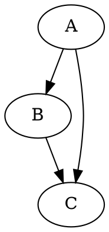
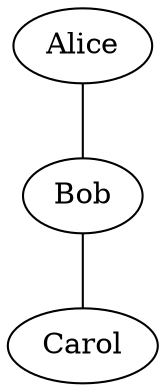

# `Graphviz` Note

Graphviz is an open-source graph visualization software. It takes descriptions of graphs in a simple text language called DOT and produces diagrams in useful formats, such as images and SVG.

This note focuses on the `dot` command, which is a core part of the Graphviz suite.

For more advanced usage, see [[graphviz_advanced]].

## Basic Usage: Creating a Graph

1.  **Create a `.dot` file**: This plain text file will contain the description of your graph.
2.  **Run the `dot` command**: This command will process your `.dot` file and generate an image.

### DOT Language Basics

- **`digraph { ... }`**: Defines a directed graph.
- **`graph { ... }`**: Defines an undirected graph.
- **`A -> B;`**: Creates a directed edge from node `A` to node `B`.
- **`A -- B;`**: Creates an undirected edge between node `A` and node `B`.

### Basic Examples

**1. Simple Directed Graph**

Create a file named `simple.dot`:


Now, generate a PNG image from this file:
```bash
dot -Tpng simple.dot -o simple.png
```
- **`-Tpng`**: Specifies the output format (PNG).
- **`-o simple.png`**: Specifies the output file name.

**2. Simple Undirected Graph**

Create a file named `friends.dot`:


Generate the image:
```bash
dot -Tpng friends.dot -o friends.png
```
