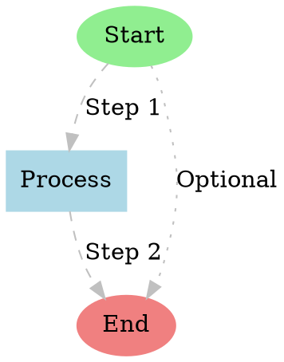
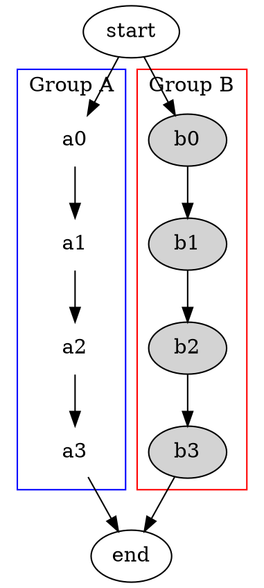

# `Graphviz` Advanced Usage

This note covers more advanced Graphviz features. For a basic introduction, see [[graphviz]].

## Node and Edge Attributes

You can customize the appearance of nodes and edges using attributes.

- **`label`**: Sets the display text for a node or edge.
- **`shape`**: Changes the shape of a node (e.g., `box`, `ellipse`, `circle`).
- **`color`**: Sets the color of nodes, edges, or text.
- **`style`**: Changes the style (e.g., `filled`, `dashed`, `bold`).

### Advanced Example

Create a file named `custom.dot`:


Generate the image:
```bash
dot -Tpng custom.dot -o custom.png
```

## Different Layout Engines

Graphviz includes several layout engines for different types of graphs:

- **`dot`**: The default, for hierarchical or layered drawings.
- **`neato`**: For "spring model" layouts.
- **`fdp`**: For force-directed graphs.
- **`circo`**: For circular layouts.
- **`twopi`**: For radial layouts.

To use a different engine, simply replace the `dot` command:

```bash
# Use the neato engine for a spring model layout
neato -Tpng custom.dot -o custom_neato.png

# Use the circo engine for a circular layout
circo -Tpng custom.dot -o custom_circo.png
```

## Subgraphs and Clusters

You can group nodes together using subgraphs. If the subgraph name starts with `cluster`, Graphviz will draw a box around it.

Create a file named `cluster.dot`:


Generate the image:
```bash
dot -Tpng cluster.dot -o cluster.png
```
